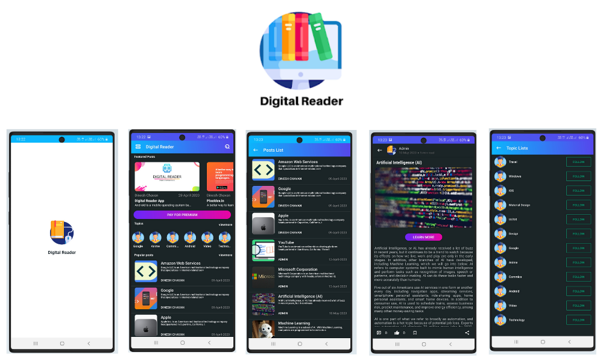

# Blog-Posting-Android-App(Digital-Reader) 🆕

  
 

## The Digital Reader App it is an app for people who loves Reading Books, Blogs or Posts and the Peoples who like to Posts new Things.

- PERSONALIZED : You read Different Posts Daily with category/Topic wise. 💻
- FOLLOW : Follow the Topics that You like it.🚶
- WRITER : You can Compose the new Stories and share it with others also it is flexible to read posts on any devices. ✏

### Features Implemented 👍
- User Login, 🔑SignUp 🔒 and User Authentication 📫 (Authentication is with PHPMailer)
- Add post with Image and description
- Main news feed which displays all the posts posted by all the users 📘
- Comment and like feature for posts 📕
- Now read all posts when your offline (Room Database).
- Trending Section, New Categories also List Of Posts Added.
- follow your favorite topic, 🔖 bookmark your favorite Posts.📗
- Razor Pay Payment Gateways for Premium Subscription 💳
- Referal Code system
- some bugs are fixed. 🐛

### Technology, library,APIs,Software
- Material Design 
- Volley library
- Room Database (Offline Storage)
- Razor Pay Payment Gateway
- API's Developed Using PHP 

📧 Have any query related to app please contact me.
